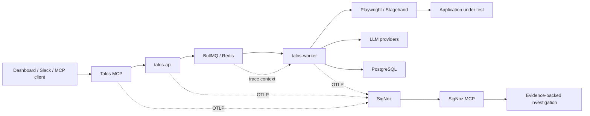

# Talos Observability

<p align="center">
  <strong>The black-box recorder for autonomous browser-testing agents.</strong>
</p>

<p align="center">
  Talos correlates every API request, queue transition, browser action, LLM call,
  network failure, bug, token, cost, log, and run outcome in SigNoz through
  OpenTelemetry.
</p>

<p align="center">
  
  
  
  
</p>

## Hackathon submission

**Event:** Agents of SigNoz  
**Track:** AI & Agent Observability  
**Project:** Talos Observability

> Talos turns autonomous browser tests into fully observable distributed
> workflows. When an agent fails, engineers can move from a generic “blocked”
> result to an evidence-backed explanation spanning the initiating request,
> queue, worker, browser, LLM provider, target application, database, logs,
> metrics, and traces.

- [Hackathon project brief](AGENTS_OF_SIGNOZ.md)
- [Complete SigNoz setup and operations runbook](docs/signoz-observability.md)
- [SigNoz documentation](https://signoz.io/docs/introduction/)
- [SigNoz Agent Skills](https://github.com/SigNoz/agent-skills)

## The problem

AI browser agents are difficult to debug because a single user-visible test can
cross several independent systems:

1. A dashboard, Slack agent, or MCP client starts the test.
2. A Fastify API validates the request and publishes a BullMQ job.
3. Redis delivers the job to a separate worker process.
4. The worker launches Playwright or Stagehand.
5. Navigator, review, triage, and memory agents call one or more LLM providers.
6. Browser actions trigger APIs inside the application under test.
7. PostgreSQL persists steps, evidence, bugs, costs, and final results.

Without cross-service observability, a failed run rarely reveals whether the
root cause was queue delay, an LLM error, a browser-action failure, an HTTP 500
from the target application, a database problem, or resource pressure.

## The solution

Talos emits standard OpenTelemetry traces, metrics, and correlated logs to
SigNoz. Each test becomes a navigable distributed workflow instead of a set of
disconnected application records.



SigNoz provides the operational layer for:

- End-to-end traces from API ingestion through queue processing and agent execution.
- Correlated application logs with trace and span context.
- Agent, LLM, token, cost, network, and QA metrics.
- Query Builder analysis across traces, metrics, and logs.
- Dashboards for run health, LLM operations, and QA reliability.
- Alerts for failures, stalls, latency degradation, cost spikes, and missing telemetry.
- MCP-assisted investigations grounded in live observability data.

## Why Talos and SigNoz work well together

| Talos signal | What SigNoz reveals |
|---|---|
| API request | Who started the run, when it was accepted, and how long enqueueing took |
| BullMQ job | Queue publish, wait, processing, completion, and failure relationships |
| Browser-agent lifecycle | Total run duration, outcome, actions, plans, and review stages |
| LLM call | Provider, model, agent role, latency, tokens, cost, retries, and errors |
| Browser network failure | The action that triggered the request and the returned status code |
| PostgreSQL and Redis operations | Storage and queue dependencies inside the same trace |
| Pino log | Human-readable diagnostics correlated with the active trace and run |
| QA result | Bug type, source, severity, and the run that produced it |

The goal is not simply to “send logs to a dashboard.” The goal is to preserve
causality across the complete autonomous-agent workflow.

## Observable execution model

A representative run appears as one connected trace:

```text
talos.agent.run
├── Fastify request and route spans
├── BullMQ publish
├── BullMQ process
├── environment preflight
├── browser launch
├── agent navigation
│   ├── gen_ai.chat
│   ├── browser action event
│   ├── HTTP request
│   └── network-error event
├── filmstrip review
├── holistic review
├── bug triage
├── memory curation
├── PostgreSQL persistence
└── run completion
```

### Service identities

Talos uses separate OpenTelemetry service identities so SigNoz can display the
actual system topology:

- `talos-api`
- `talos-worker`
- `talos-slack-agent` when enabled
- `talos-mcp` for the MCP child process

## Custom telemetry

### Metrics

| Metric | Type | Unit | Purpose |
|---|---|---:|---|
| `talos.agent.runs.active` | UpDownCounter | `{run}` | Runs currently executing |
| `talos.agent.runs` | Counter | `{run}` | Completed runs by status, environment, and trigger |
| `talos.agent.run.duration` | Histogram | `s` | End-to-end run duration |
| `talos.agent.steps` | Counter | `{step}` | Browser steps by action, status, source, and execution method |
| `talos.gen_ai.calls` | Counter | `{call}` | LLM calls by provider, model, agent, and status |
| `talos.gen_ai.call.duration` | Histogram | `s` | LLM call latency |
| `talos.gen_ai.tokens` | Counter | `{token}` | Input and output token consumption |
| `talos.gen_ai.cost` | Counter | `{USD}` | Estimated model cost |
| `talos.browser.network.errors` | Counter | `{error}` | Action-correlated browser API failures |
| `talos.qa.bugs` | Counter | `{bug}` | Bugs by type, severity, and source |

### Trace events

Talos records bounded operational events for:

- Run start, completion, and crash.
- Agent-plan updates.
- Browser-agent steps.
- Agent activity.
- Browser network failures.
- LLM calls and failures.
- Final run outcome and evidence counts.

### Cardinality policy

High-cardinality identifiers such as `runId`, `projectId`, `testId`, and step
index are useful during investigation, so they are attached to spans and logs.
They are intentionally excluded from metric labels.

## Core product capabilities

Talos remains a complete agentic QA platform in addition to its SigNoz
observability layer.

### Autonomous browser testing

- Natural-language testing goals.
- Real browser execution with Playwright.
- Semantic element interaction through Stagehand.
- Authenticated application testing.
- DOM, accessibility-tree, and screenshot-informed navigation.
- Action-correlated browser network monitoring.
- Flow discovery and exploratory QA.

### Multi-agent analysis

- Navigator agent for browser execution.
- Filmstrip and holistic visual review.
- Bug-triage agent.
- Flow-discovery agent.
- Project memory curation.
- Multiple model providers through OpenAI, Anthropic, Gemini, and OpenRouter.

### Evidence and governance

- Live run streaming.
- Step-by-step execution history.
- Screenshots and video recording.
- LLM usage and estimated cost records.
- Durable PostgreSQL persistence.
- Human review and bug management.
- Talos MCP server and TypeScript client.
- Slack Release Commander.
- Optional UiPath Test Cloud export.

## Demo scenario

The recommended hackathon demonstration uses one controlled checkout failure:

1. Start a checkout test from the Talos dashboard, Slack agent, or Talos MCP.
2. `talos-api` accepts the request and publishes a BullMQ job.
3. The active OpenTelemetry context follows the job into `talos-worker`.
4. The worker launches the browser agent and calls the configured LLM provider.
5. The target checkout API intentionally returns HTTP 500 during payment.
6. Talos records the action-correlated network failure and marks the run blocked or failed.
7. A SigNoz alert identifies the failure condition.
8. SigNoz MCP investigates the trace, logs, metrics, slow operations, token usage, and related runs.
9. The final report explains the likely cause and cites the observable evidence behind the conclusion.

This demonstrates the complete loop:

```text
instrumented agent execution
        ↓
cross-signal detection in SigNoz
        ↓
alert and dashboard visibility
        ↓
MCP-assisted investigation
        ↓
evidence-backed root-cause report
```

## Quick start

### Prerequisites

- Node.js 20 or newer.
- Docker and Docker Compose.
- [SigNoz Foundry](https://github.com/SigNoz/foundry).
- At least one supported LLM API key.
- At least 4 GB of memory available to the SigNoz deployment.

For Windows development, run the SigNoz stack with Docker Engine inside WSL 2.

### 1. Clone and configure Talos

```bash
git clone https://github.com/mylife-as-miles/talos-engine.git
cd talos-engine
cp .env.example .env
```

Add at least one provider key to `.env`:

```bash
OPENROUTER_API_KEY=
OPENAI_API_KEY=
ANTHROPIC_API_KEY=
GEMINI_API_KEY=
```

OpenRouter is the simplest way to access several model families with one key.
Direct provider keys also work.

### 2. Finalize and validate the SigNoz build

```bash
npm run signoz:finalize
```

This command:

- Installs dependencies.
- Regenerates `package-lock.json`.
- Builds every workspace.
- Validates `casting.yaml`.
- Generates the reproducible Foundry `casting.yaml.lock`.

### 3. Deploy SigNoz and its MCP server

```bash
foundryctl cast -f casting.yaml
```

Expected local endpoints:

| Service | URL |
|---|---|
| SigNoz UI | `http://localhost:8080` |
| OTLP gRPC | `http://localhost:4317` |
| OTLP HTTP | `http://localhost:4318` |
| SigNoz MCP | `http://localhost:8000/mcp` |

### 4. Start Talos dependencies

```bash
docker compose up postgres redis -d
npm run migrate
```

### 5. Start Talos with observability enabled

```bash
npm run dev:observed
```

The observed launcher starts the API, worker, and web application with distinct
service names and loads OpenTelemetry before application modules are imported.

| Service | URL |
|---|---|
| Talos dashboard | `http://localhost:11111` |
| Talos development API | `http://localhost:11114` |

To include the Slack agent and its Talos MCP child process:

```bash
TALOS_OBSERVE_SLACK=true npm run dev:observed
```

### Dockerized Talos option

The Talos Docker Compose configuration sends OTLP HTTP data to
`host.docker.internal:4318` by default:

```bash
docker compose up --build
```

Override the collector endpoint when necessary:

```bash
OTEL_EXPORTER_OTLP_ENDPOINT=http://collector.example:4318 docker compose up --build
```

## Verify ingestion in SigNoz

Run one short Talos test before creating dashboards or alerts. Then verify:

1. `talos-api` and `talos-worker` appear in the Services view.
2. A `talos.agent.run` trace is present for the worker.
3. The trace includes BullMQ producer and consumer activity.
4. PostgreSQL, Redis, HTTP, and LLM operations appear beneath the run.
5. Pino logs contain trace and span context.
6. Metrics beginning with `talos.` are discoverable.
7. A failed browser request appears as a network-error event.

Always discover live field names independently for traces, logs, and metrics
before building Query Builder expressions. A field present on one signal is not
guaranteed to exist on another.

## Recommended SigNoz dashboard

Create a custom dashboard after telemetry is flowing.

### Run health

- Active runs.
- Completed runs by outcome.
- Success and failure ratio.
- P50, P95, and P99 run duration.
- Queue publish and processing latency.

### Agent execution

- Steps by browser action.
- Failed steps by action type.
- Stagehand, Playwright, and coordinate execution split.
- Recent run traces with environment and outcome.

### LLM operations

- Calls by provider, model, and agent role.
- P50, P95, and P99 model latency.
- Input and output tokens.
- Estimated model cost over time.
- LLM error rate.

### QA reliability

- Network failures by status and severity.
- Bugs by severity, type, and source.
- Worker error-log trend.
- Recent failed runs linked to traces.

For low-volume, human-paced counters, prefer per-interval `increase` views over
tiny per-second rates.

## Recommended alerts

Create alert rules only after confirming that the exact signal and resource
filter emit live data.

| Alert | Initial condition | Severity |
|---|---|---|
| Run failure rate | Failed runs exceed 20% over 10 minutes | Critical |
| Stalled run | Active run has no progress or completion signal for 5 minutes | Critical |
| LLM error rate | Failed model calls exceed 10% over 5 minutes | Warning |
| LLM latency degradation | P95 exceeds the observed baseline | Warning |
| Model-cost spike | Cost increase exceeds the selected budget | Warning |
| Browser API failures | Repeated high-severity failures within 5 minutes | Warning |
| Missing telemetry | API or worker data stops arriving | Critical in production |

Alert annotations should include the resource scope, current value, threshold,
owning team, and a real runbook link.

## SigNoz MCP workflow

The MCP server is an investigation and control interface, not the telemetry
transport. Talos sends telemetry through OTLP; SigNoz MCP queries the resulting
traces, metrics, logs, dashboards, and alerts.

1. Create a least-privilege SigNoz service account.
2. Create an API key for that account.
3. Store the key in the MCP client secret store or request header.
4. Connect the client to `http://localhost:8000/mcp`.
5. Install the official [SigNoz Agent Skills](https://github.com/SigNoz/agent-skills).
6. Use Talos MCP to start or inspect a run and SigNoz MCP to investigate it.

Example investigation request:

```text
Investigate Talos run <run-id>. Find its talos.agent.run trace, identify the
slowest agent, LLM, browser, queue, and storage operations, correlate error logs
and network-error events, compare the run with recent successful runs in the
same environment, and return evidence-backed likely causes.
```

API keys are never stored in `casting.yaml` or committed to the repository.

## Privacy and security

Talos exports operational metadata, not testing content.

The default configuration explicitly disables GenAI message-content capture:

```bash
OTEL_INSTRUMENTATION_GENAI_CAPTURE_MESSAGE_CONTENT=false
```

Custom telemetry does not intentionally include:

- Authentication credentials, tokens, cookies, or TOTP secrets.
- LLM prompts, complete responses, or tool arguments.
- Screenshots, videos, DOM content, or accessibility trees.
- User-provided form values.
- API keys or service-account credentials.
- Full target URLs containing query strings or fragments.

Detailed testing evidence remains inside Talos’s existing application storage.

## Architecture and repository layout

```text
apps/
  api/              Fastify API and run enqueueing
  web/              React and Vite dashboard
  worker/           BullMQ worker and run persistence
  slack-agent/      Slack Release Commander

packages/
  client/           TypeScript Talos API client
  db/               PostgreSQL adapter and migrations
  engine/           Browser agent, review agents, memory, and OTel domain signals
  mcp/              Talos Model Context Protocol server
  talos/            CLI setup package

scripts/
  otel-register.cjs OpenTelemetry preload registration
  dev-observed.mjs  Multi-service observed development launcher
  finalize-signoz.sh Build and Foundry finalization

casting.yaml        Reproducible SigNoz + MCP deployment definition
```

## Important environment variables

| Variable | Purpose |
|---|---|
| `DATABASE_URL` | PostgreSQL connection string |
| `REDIS_URL` | BullMQ and live-run Redis connection |
| `OPENROUTER_API_KEY` | OpenRouter model access |
| `OPENAI_API_KEY` | Direct OpenAI access |
| `ANTHROPIC_API_KEY` | Direct Anthropic access |
| `GEMINI_API_KEY` | Direct Gemini access |
| `AGENT_MODEL` | Browser navigator model |
| `AUXILIARY_MODEL` | Planning, discovery, memory, and summaries |
| `REVIEW_AGENT_MODEL` | Post-run review model |
| `OTEL_EXPORTER_OTLP_ENDPOINT` | OTLP HTTP collector endpoint |
| `OTEL_SERVICE_NAME` | Service identity reported to SigNoz |
| `TALOS_ENVIRONMENT_NAME` | Deployment environment resource value |
| `TALOS_OBSERVE_SLACK` | Starts the optional observed Slack agent |
| `RUN_TIMEOUT_MINUTES` | Maximum browser-run duration |

See [`.env.example`](.env.example) for the complete configuration reference.

## Development commands

```bash
npm run dev                 # Standard local development
npm run dev:observed        # API, worker, and web with OpenTelemetry
npm run dev:api             # API only
npm run dev:worker          # Worker only
npm run dev:web             # Web dashboard only
npm run dev:slack           # Slack agent only
npm run migrate             # Run PostgreSQL migrations
npm run build               # Build all workspaces
npm run test:slack          # Run Slack-agent tests
npm run signoz:finalize     # Install, build, validate Foundry, and generate locks
```

If Playwright reports that Chromium is missing:

```bash
npx playwright install chromium
```

## Hackathon development disclosure

Talos existed before Agents of SigNoz as an agentic browser-testing platform.
The following were built specifically for this hackathon branch:

- OpenTelemetry Node bootstrap and OTLP export.
- Fastify route and handler instrumentation.
- BullMQ producer-to-consumer context propagation.
- Separate API, worker, Slack, and MCP service identities.
- `talos.agent.run` lifecycle spans.
- Provider-neutral GenAI spans.
- Agent, LLM, cost, token, QA, and network metrics.
- Agent-plan, browser-step, network-failure, completion, and crash events.
- Explicit privacy and metric-cardinality controls.
- Foundry deployment with SigNoz MCP enabled.
- Dashboard, alert, IAM, investigation, and demo runbooks.

See [AGENTS_OF_SIGNOZ.md](AGENTS_OF_SIGNOZ.md) for the complete pre-existing
foundation and hackathon-work breakdown.

## Validation status

The source-level integration is implemented on the hackathon branch. Before a
final submission or production merge, complete the following live checks:

- Run `npm run signoz:finalize` and commit the generated lockfiles.
- Start a local SigNoz deployment through Foundry.
- Execute one controlled passing run and one controlled failing run.
- Confirm traces, metrics, and correlated logs in SigNoz.
- Create dashboard panels from discovered live fields.
- Create and validate the final alert rules.
- Run one end-to-end MCP-assisted investigation.

Generated lockfiles and successful live-ingestion results must be produced by a
real networked environment; they should never be fabricated.

## Built with

- [SigNoz](https://signoz.io/)
- [OpenTelemetry](https://opentelemetry.io/)
- [SigNoz Foundry](https://github.com/SigNoz/foundry)
- [SigNoz Agent Skills](https://github.com/SigNoz/agent-skills)
- [Playwright](https://playwright.dev/)
- [Stagehand](https://github.com/browserbase/stagehand)
- [Fastify](https://fastify.dev/)
- [BullMQ](https://bullmq.io/)
- [PostgreSQL](https://www.postgresql.org/)
- [Redis](https://redis.io/)

---

<p align="center">
  <strong>Talos makes autonomous browser agents observable, explainable, and operationally accountable.</strong>
</p>
