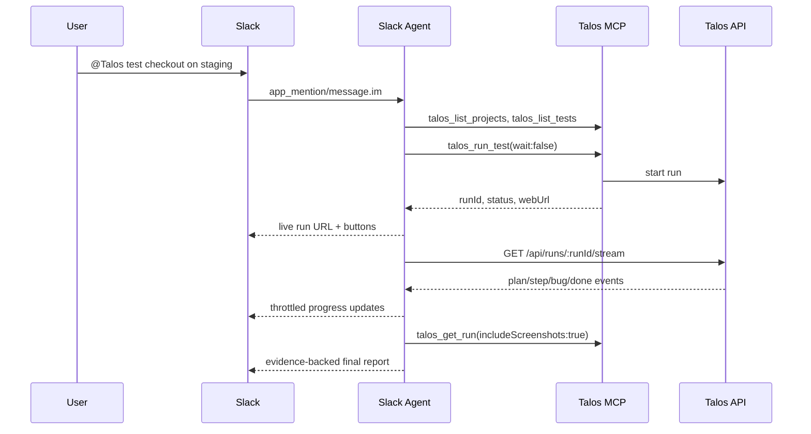

# Slack Agent Architecture

```mermaid
graph TD
  Slack[Slack DM or mention] --> Agent[apps/slack-agent]
  Agent -->|MCP stdio| MCP[packages/mcp]
  MCP --> Client[@talosai/client]
  Client --> API[Talos API / queue / browser worker]
  API -->|SSE /api/runs/:runId/stream| Agent
  Agent -->|thread updates + report| Slack
```


