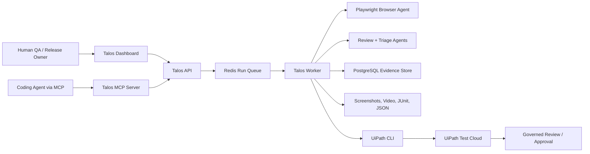

# UiPath AgentHack Submission Guide

This guide turns Talos into a submission-ready Track 3 project for UiPath AgentHack.

## Track

**Track 3: UiPath Test Cloud**

Talos is an agentic TestOps platform for enterprise web applications. Coding agents and LLM-powered browser agents discover flows, execute tests, capture evidence, classify bugs, and hand completed run records into UiPath Test Cloud for governed execution visibility.

## Business Problem

Enterprise teams ship through complex workflows where test coverage is slow to update, brittle automation breaks often, and AI-driven features create behavior that is hard to validate manually. QA, engineering, and release teams need a way to increase test coverage while keeping execution auditable and human-governed.

Talos addresses this by:

- Turning natural-language test intent into browser execution.
- Capturing screenshots, recordings, steps, LLM calls, bugs, and severity.
- Keeping human triage in the loop for high-impact failures.
- Publishing completed run evidence into UiPath Test Cloud.
- Letting coding agents act on discovered bugs through MCP.

## UiPath Components Used

- **UiPath Automation Cloud**: required runtime and governance environment for the hackathon.
- **UiPath Test Cloud / Test Manager**: receives Talos test run payloads and provides the governed enterprise test record.
- **UiPath CLI**: invoked by the Talos worker after each run to submit execution data to the configured Test Cloud project/test set.
- **UiPath for Coding Agents**: used during development and demo positioning to show Codex/coding-agent participation.

Optional expansion:

- **API Workflows**: can wrap the Talos REST API to start runs from UiPath.
- **Agent Builder**: can add a low-code triage or release-readiness agent that reads the Talos payload and recommends approval, retry, or human review.
- **Maestro**: can orchestrate a release validation process where Talos/Test Cloud is one task in a larger deployment gate.

## Architecture

## End-to-End Demo Flow

1. Open the Talos dashboard and show a configured project/environment.
2. Start a natural-language test such as: "Verify checkout catches invalid payment details and shows a helpful error."
3. Show the live run view as the browser agent navigates, observes, plans, and captures evidence.
4. Show one detected issue with screenshot, severity, step trace, and video evidence.
5. Show the worker-created `data/uipath-test-cloud/<runId>/talos-run.json` and `talos-junit.xml` artifacts.
6. Show the UiPath Test Cloud project/test set receiving or running the submitted execution.
7. Show the human decision point: approve release, retry test, or mark bugs for fix.
8. Show a coding agent using MCP to inspect or fix issues from the Talos bug queue.

## Setup Checklist

- Register the project on Devpost.
- Request UiPath Labs access for the team representative.
- Create or identify a UiPath Test Cloud / Test Manager project.
- Create or identify a test set for Talos agentic browser runs.
- Install and authenticate the UiPath CLI in the runtime environment.
- Configure `.env` with `UIPATH_TEST_CLOUD_ENABLED=true`.
- Set `UIPATH_TEST_CLOUD_PROJECT_KEY` and `UIPATH_TEST_CLOUD_TEST_SET_KEY`.
- Run `npm run build --workspace=apps/worker` after configuration changes.
- Run one Talos test and confirm `data/uipath-test-cloud/<runId>/` contains JSON/JUnit artifacts.
- Confirm the UiPath Test Cloud execution is visible in Automation Cloud.

## Devpost Description Draft

Talos is an agentic TestOps platform that uses coding agents and browser automation to validate enterprise web applications with less brittle test maintenance. A user describes a business-critical workflow in plain language, and Talos runs an AI browser agent that navigates the app, records steps, captures screenshots and video, detects visual/functional/UX issues, and triages bugs by severity.

For UiPath AgentHack, Talos integrates with UiPath Test Cloud as the governed execution layer. Each completed Talos run produces a structured evidence payload and JUnit report, then submits the execution through the UiPath CLI into a configured Test Cloud project and test set. UiPath Automation Cloud becomes the control plane for visibility, auditability, and human review, while Talos supplies the coding-agent testing layer.

The solution demonstrates how agentic testing can improve coverage and release confidence while keeping humans accountable for high-impact decisions.

## Demo Video Outline

- **0:00-0:30**: Problem and Track 3 framing.
- **0:30-1:15**: Architecture: Talos agents, MCP/coding agent, worker, UiPath Test Cloud.
- **1:15-2:45**: Live Talos run against a web app.
- **2:45-3:30**: Evidence: steps, screenshot, video, bug severity, run status.
- **3:30-4:20**: UiPath Test Cloud handoff and Automation Cloud visibility.
- **4:20-5:00**: Human review, coding-agent bonus, and business value.

## Submission Assets Checklist

- Public GitHub repository.
- README with setup instructions and UiPath components used.
- MIT or Apache 2.0 license.
- Devpost page with screenshots.
- Demo video, 5 minutes maximum.
- Presentation deck link with public viewing enabled.
- UiPath Automation Cloud/Test Cloud environment ready for the demo.
- Optional product feedback form for the Best Product Feedback award.

## Notes For Judges

Talos uses external LLM providers and coding-agent-friendly MCP tools, but UiPath remains the orchestration and governance layer for the AgentHack submission. The project is intentionally aligned to Track 3 because its core business outcome is better enterprise software testing through agentic execution, evidence capture, and governed review.
